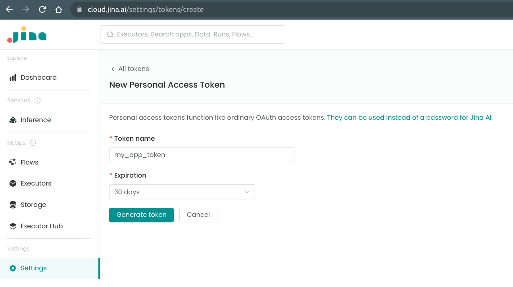
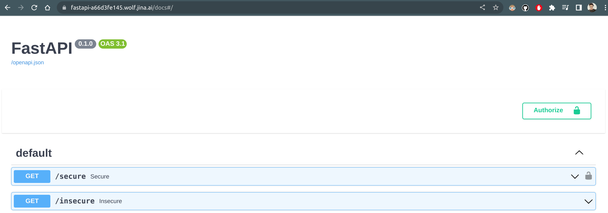

## 🔒 Secure Your Endpoints with Built-in Authorization

With `fastapi-serve`, securing your endpoints becomes a seamless process. There is no need for complex integration with external authorization providers, saving you time and effort in developing and maintaining your applications. This integration reduces the amount of code you have to manage, decreasing potential the number of potential points of failure and making your application more reliable and robust.

You can utilize and manage your Jina account's `OAuth2.0` tokens directly in `fastapi-serve`. It is designed to be an out-of-the-box solution for securing your endpoints, so you can focus on what matters most - developing the core functionality of your FastAPI applications.

You have the flexibility to implement authorization in your FastAPI application in two ways: as "Middleware" or as a "Dependency". The implementation depends on your application's specific requirements.

### 🔧 Using Middleware 

Using the Middleware approach, you can apply authorization globally to all endpoints or selectively ignore certain endpoints. You can use `JinaAuthMiddleware` to apply authorization globally to all endpoints. ([Full example](middleware/main.py))

```python
# main.py
from fastapi import Depends, FastAPI

from fastapi_serve import JinaAPIKeyHeader, JinaAuthMiddleware

app = FastAPI()
app.add_middleware(
    JinaAuthMiddleware,
    exclude_paths=JinaAuthMiddleware.SKIPPED_PATHS + ["/insecure"],
)


@app.get("/secure", dependencies=[Depends(JinaAPIKeyHeader)])
def secure():
    return {"info": "user_specific_info"}


@app.get("/insecure")
def insecure():
    return {"info": "general_info"}
```

### ⚙️ Using Dependency

If you want to apply authorization selectively to individual endpoints, you can use `JinaAuthDependency`. This method allows you to add authorization as a dependency in your endpoint function definitions ([Full example](dependency/main.py))


```python
# main.py
from fastapi import Depends, FastAPI

from fastapi_serve import JinaAPIKeyHeader, JinaAuthDependency

app = FastAPI()
auth = JinaAuthDependency()


@app.get("/secure", dependencies=[Depends(auth), Depends(JinaAPIKeyHeader)])
def secure():
    return {"info": "user_specific_info"}


@app.get("/insecure")
def insecure():
    return {"info": "general_info"}
```

### 🚀 Deploying to Jina AI Cloud

```bash
fastapi-serve deploy jcloud main:app
```

```text
╭─────────────────────────┬───────────────────────────────────────────────────────────╮
│ App ID                  │                    fastapi-a66d3fe145                     │
├─────────────────────────┼───────────────────────────────────────────────────────────┤
│ Phase                   │                          Serving                          │
├─────────────────────────┼───────────────────────────────────────────────────────────┤
│ Endpoint                │          https://fastapi-a66d3fe145.wolf.jina.ai          │
├─────────────────────────┼───────────────────────────────────────────────────────────┤
│ App logs                │                  https://cloud.jina.ai/                   │
├─────────────────────────┼───────────────────────────────────────────────────────────┤
│ Base credits (per hour) │             10.104 (Read about pricing here)              │
├─────────────────────────┼───────────────────────────────────────────────────────────┤
│ Swagger UI              │       https://fastapi-a66d3fe145.wolf.jina.ai/docs        │
├─────────────────────────┼───────────────────────────────────────────────────────────┤
│ OpenAPI JSON            │   https://fastapi-a66d3fe145.wolf.jina.ai/openapi.json    │
╰─────────────────────────┴───────────────────────────────────────────────────────────╯
```

### 🔑 Managing tokens

Both methods use `OAuth2.0` tokens associated with your Jina account to authenticate and authorize access to your endpoints. You can manage these tokens through the [Jina AI Cloud UI](https://cloud.jina.ai/settings/tokens/).

<p align="center">
  
</p>

### 💻 Testing

Once the secured endpoints are deployed, you can test the access control using curl or through the Swagger UI. 

#### Using curl
To send a request to the `/secure` endpoint, you need to include the token in the `Authorization` header:

```bash
curl -X 'GET' 'https://fastapi-a66d3fe145.wolf.jina.ai/secure' \
  -H 'Authorization: Bearer <your-token>'
```

```json
{
  "info": "user_specific_info"
}
```

Missing/Invalid tokens will result in a `401 Unauthorized` response. Since the `/insecure` endpoint is not secured, you can access it without a token:

```bash
curl -X 'GET' 'https://fastapi-a66d3fe145.wolf.jina.ai/insecure'
```

```json
{
  "info": "general_info"
}
```

#### Using Swagger UI

Adding `JinaKeyHeader` to the dependencies of the `/secure` endpoint will add an `Authorize` button to the Swagger UI. Clicking on the button will open a popup where you can enter your token. Once you enter the token, you can send requests to the `/secure` endpoint from the Swagger UI.

<p align="center">
  
</p>

### 🎛️ Built-In or Bring-Your-Own

The built-in authorization feature of `fastapi-serve` empowers you by eliminating the need to integrate with external authentication providers. This frees you up to focus on building your application, rather than worrying about securing your endpoints.

However, the real power lies in its flexibility. If your application has specific needs or you prefer to use an external OAuth provider like Google, Facebook, or GitHub, `fastapi-serve` is designed to easily adapt to these requirements. You retain complete control over your application's security, while benefiting from the convenience of an out-of-the-box solution. It's the best of both worlds - seamless built-in security, with the flexibility to customize as you see fit.
