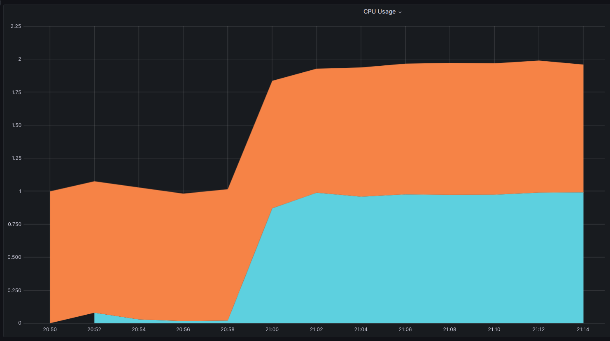

### 💹 Auto-scaling endpoints based on CPU usage

Autoscaling your FastAPI apps brings in significant benefits like improved performance, optimized resource usage and cost-effectiveness. It lets you efficiently manage traffic spikes and varying loads, ensuring your application remains responsive at all times.

`fastapi-serve` provides built-in support for auto-scaling your FastAPI apps based on CPU usage. You can configure the CPU threshold for scaling up and down, and the maximum number of replicas to scale up to by passing a `jcloud.yml` file either during deployment with a `--config` file or within the app directory.

```yaml
instance: C3
autoscale:
  min: 1
  max: 2
  metric: cpu
  target: 40
```

The above configuration will scale up the app to 2 replicas when the CPU usage exceeds 40% and scale down to 1 replica when the CPU usage falls below 40%.

Let's look at an example of how to auto-scale a FastAPI app based on CPU usage.

### 📈 Deploy a FastAPI app with auto-scaling based on CPU usage

This directory contains the following files:

```
.
├── app.py              # The FastAPI app
├── jcloud.yml          # JCloud deployment config with the autoscaling config
└── README.md           # This README file
```

```python
# app.py
import os
import time

from fastapi import FastAPI
from pydantic import BaseModel, Field

app = FastAPI()


class Response(BaseModel):
    cpu_time: float
    result: int
    hostname: str = Field(default_factory=lambda: os.environ.get("HOSTNAME", "unknown"))


def _heavy_compute(count):
    sum = 0
    for i in range(count):
        sum += i
    return sum


@app.get("/load/{count}", response_model=Response)
def load_test(count: int = 1_000_000):
    _t1 = time.time()
    _sum = _heavy_compute(count)
    _t2 = time.time()
    _cpu_time = _t2 - _t1
    print(f"CPU time: {_cpu_time}")
    return Response(cpu_time=_cpu_time, result=_sum)

```

In the above example, we have a `/load` endpoint that performs a CPU intensive task. We will use this endpoint to simulate a CPU intensive workload.


### 🚀 Deploying to Jina AI Cloud

```bash
fastapi-serve deploy jcloud app:app
```

```text
╭─────────────────────────┬─────────────────────────────────────────────────────────────────────────────╮
│ App ID                  │                             fastapi-2a94b25a5f                              │
├─────────────────────────┼─────────────────────────────────────────────────────────────────────────────┤
│ Phase                   │                                   Serving                                   │
├─────────────────────────┼─────────────────────────────────────────────────────────────────────────────┤
│ Endpoint                │                   https://fastapi-2a94b25a5f.wolf.jina.ai                   │
├─────────────────────────┼─────────────────────────────────────────────────────────────────────────────┤
│ App logs                │                           https://cloud.jina.ai/                            │
├─────────────────────────┼─────────────────────────────────────────────────────────────────────────────┤
│ Base credits (per hour) │                      10.104 (Read about pricing here)                       │
├─────────────────────────┼─────────────────────────────────────────────────────────────────────────────┤
│ Swagger UI              │                https://fastapi-2a94b25a5f.wolf.jina.ai/docs                 │
├─────────────────────────┼─────────────────────────────────────────────────────────────────────────────┤
│ OpenAPI JSON            │            https://fastapi-2a94b25a5f.wolf.jina.ai/openapi.json             │
╰─────────────────────────┴─────────────────────────────────────────────────────────────────────────────╯
```


### 💻 Testing

Let's send a few requests to the `/load` endpoint to simulate a not-so-intense workload.

```bash
curl -sX GET https://fastapi-2a94b25a5f.wolf.jina.ai/load/1000000 | jq
```

```json
{
  "cpu_time": 0.4925811290740967,
  "result": 499999500000,
  "hostname": "gateway-00001-deployment-85589655bb-pn7b4"
}
```

This finishes in about 49ms. Let's send a one request with intense workload.

```bash
curl -sX GET https://fastapi-2a94b25a5f.wolf.jina.ai/load/10000000000 | jq
```

While the request is being processed, you can see the CPU usage in the `CPU` graph. It will go above 40% and the app will be scaled up to 2 replicas. Meanwhile, let's open another terminal and send a few more requests to the `/load` endpoint in a loop.

```bash
for i in {1..1000}; do curl -sX GET https://fastapi-2a94b25a5f.wolf.jina.ai/load/1000000 | jq; sleep 0.5; done
```

Eventually you'd see that requests are being served by 2 replicas (denoted by the `hostname` field in the response). 

```json
{
  "cpu_time": 0.11650848388671875,
  "result": 499999500000,
  "hostname": "gateway-00001-deployment-85589655bb-pn7b4"
}
{
  "cpu_time": 0.1402430534362793,
  "result": 499999500000,
  "hostname": "gateway-00001-deployment-85589655bb-gr6sc"
}
```

> **Note**: 
> You might see a "The upstream server is timing out" message during long running requests. This can be configured during `timeout` argument in `jcloud.yml` file. Since we didn't configure it, requests will time out after 120 seconds by default.


### 📊 Observe the CPU usage

To view the CPU usage, you can go [Jina AI Cloud](https://cloud.jina.ai/user/flows). Click on the `fastapi-2a94b25a5f` app and then click on the `Charts` tab. You can see the CPU usage in the `CPU` graph.

<p align="center">
  
</p>


### 🎯 Wrapping Up

As we've seen in this example, CPU-based autoscaling can be a game changer for FastAPI applications. It helps to efficiently manage your resources, handling traffic spikes and maintaining a responsive application under heavy workloads. `fastapi-serve` makes it straightforward to leverage autoscaling, helping you to build highly scalable, efficient, and resilient FastAPI applications with ease. Embrace the power of autoscaling with `fastapi-serve` today!
